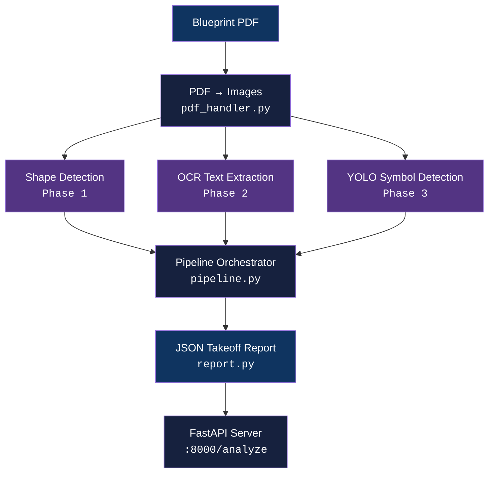

<div align="center">

# cv-pipeline

[](https://www.python.org/downloads/)
[](LICENSE)
[](#testing)
[](#)

**A progressive computer vision pipeline for construction blueprint analysis — shape detection, OCR, YOLO symbol recognition, and a multi-stage document analyzer.**

[Getting Started](#getting-started) | [Architecture](#architecture) | [Phases](#phases) | [Testing](#testing) | [API](#api-server)

</div>

---

## Features

- **Shape Detection** — Contour-based detection of rectangles, circles, triangles, and polygons using color segmentation and edge detection
- **OCR Pipeline** — Text extraction with Tesseract, preprocessing (deskew, denoise, threshold), text region grouping, and table detection
- **YOLO Symbol Detection** — YOLOv8n fine-tuned on construction symbols (arrows, dimension lines, door swings, electrical outlets)
- **Blueprint Analyzer** — Multi-stage orchestrator that composes all three phases into a single pipeline with graceful failure handling
- **FastAPI Server** — Upload a PDF blueprint and receive a structured JSON analysis report

## Tech Stack

| Component | Technology |
|-----------|------------|
| Language | Python 3.12+ |
| Computer Vision | OpenCV, NumPy |
| OCR | Tesseract (pytesseract) |
| Object Detection | YOLOv8 (ultralytics), PyTorch |
| Serving | FastAPI, Uvicorn |
| PDF Handling | pdf2image, ReportLab |
| Testing | pytest |

## Architecture



Each phase runs independently. If one stage fails (e.g., YOLO weights missing), the others still complete and their results are preserved.

## Phases

### Phase 1: Shape Detection

Contour-based detection for rectangles, squares, circles, triangles, and polygons. Uses color-segmented masks to isolate overlapping shapes, with Canny edge fallback for monochrome images.

```bash
python -m phase1_shape_detection.cli detect --input assets/sample_shapes.png --output outputs/shapes.png --json outputs/shapes.json
```

> **Deep dive:** [SHAPE_DETECTION.md](phase1_shape_detection/SHAPE_DETECTION.md) — how it works, example input/output, key concepts

### Phase 2: OCR Pipeline

Text extraction with Tesseract. Preprocessing pipeline: grayscale, denoise, deskew, threshold. Includes text region grouping and table detection via morphological line isolation.

```bash
python -m phase2_ocr_pipeline.cli extract --input assets/sample_text.png --json outputs/text.json
```

> **Deep dive:** [OCR_PIPELINE.md](phase2_ocr_pipeline/OCR_PIPELINE.md) — how it works, example input/output, key concepts

### Phase 3: YOLO Object Detection

YOLOv8n fine-tuned on 5 construction symbol classes. Synthetic dataset generation, training, evaluation (mAP@50=0.992), and inference with NMS.

```bash
python -m phase3_yolo_detection.cli generate --output data/yolo_dataset
python -m phase3_yolo_detection.cli train --data data/yolo_dataset/data.yaml --epochs 20
python -m phase3_yolo_detection.cli detect --input image.png --output output.png --weights models/best.pt
```

> **Deep dive:** [YOLO_DETECTION.md](phase3_yolo_detection/YOLO_DETECTION.md) — how it works, example input/output, key concepts

### Phase 4: Blueprint Analyzer (Capstone)

Multi-stage orchestrator that runs Phases 1-3 on each page of a PDF blueprint, producing a structured JSON takeoff report.

```bash
python -m phase4_blueprint_analyzer.cli analyze --input assets/sample_blueprint.pdf --output outputs/report.json
```

> **Deep dive:** [BLUEPRINT_ANALYZER.md](phase4_blueprint_analyzer/BLUEPRINT_ANALYZER.md) — how it works, example input/output, key concepts

## Getting Started

### Prerequisites

- Python 3.12+
- Tesseract OCR: `sudo apt-get install tesseract-ocr`
- Poppler: `sudo apt-get install poppler-utils`

### Installation

```bash
git clone https://github.com/adityonugrohoid/cv-pipeline.git
cd cv-pipeline

python -m venv .venv
source .venv/bin/activate

pip install -r requirements.txt
```

### Quick Start

```bash
# Generate sample assets
python -m phase1_shape_detection.cli generate
python -m phase2_ocr_pipeline.cli generate
python -m phase3_yolo_detection.cli generate
python -m phase4_blueprint_analyzer.cli generate

# Train YOLO (~2 min on GPU, ~10 min on CPU)
python -m phase3_yolo_detection.cli train --data data/yolo_dataset/data.yaml --epochs 20

# Run the full pipeline
python -m phase4_blueprint_analyzer.cli analyze --input assets/sample_blueprint.pdf --output outputs/report.json
```

## Project Structure

```
cv-pipeline/
├── phase1_shape_detection/       # Contour-based shape detection
│   ├── detector.py               #   Shape classification (vertex count + circularity)
│   ├── annotator.py              #   Draw detections on image
│   ├── export.py                 #   JSON export
│   └── cli.py                    #   CLI entrypoint
│
├── phase2_ocr_pipeline/          # Tesseract OCR with preprocessing
│   ├── preprocess.py             #   Deskew, denoise, threshold
│   ├── ocr_engine.py             #   Tesseract wrapper
│   ├── text_regions.py           #   Group text blocks into regions
│   ├── table_detector.py         #   Grid detection + cell OCR
│   └── cli.py                    #   CLI entrypoint
│
├── phase3_yolo_detection/        # YOLOv8 symbol detection
│   ├── dataset.py                #   Synthetic dataset generator
│   ├── train.py                  #   Fine-tune YOLOv8n
│   ├── evaluate.py               #   mAP, precision, recall
│   ├── detect.py                 #   Inference with NMS
│   ├── visualize.py              #   Draw detections
│   └── cli.py                    #   CLI entrypoint
│
├── phase4_blueprint_analyzer/    # Multi-stage capstone pipeline
│   ├── pdf_handler.py            #   PDF → images
│   ├── shape_layer.py            #   Phase 1 wrapper
│   ├── text_layer.py             #   Phase 2 wrapper
│   ├── symbol_layer.py           #   Phase 3 wrapper
│   ├── pipeline.py               #   Orchestrator with graceful failure
│   ├── report.py                 #   Structured JSON report
│   ├── serve.py                  #   FastAPI server
│   └── cli.py                    #   CLI entrypoint
│
├── assets/                       # Generated test images and PDFs
├── docs/examples/                # Input/output examples embedded in phase docs
├── models/                       # Trained model weights (gitignored)
├── outputs/                      # Generated reports (gitignored)
├── reference/                    # Original interview mock test
├── Dockerfile
└── requirements.txt
```

## Testing

```bash
# Run all tests
pytest -v

# Run a specific phase
pytest phase1_shape_detection/tests/ -v
pytest phase2_ocr_pipeline/tests/ -v
pytest phase3_yolo_detection/tests/ -v
pytest phase4_blueprint_analyzer/tests/ -v
```

| Phase | Tests | Coverage |
|-------|-------|----------|
| 1 — Shape Detection | 17 | Detection accuracy, classification, JSON export |
| 2 — OCR Pipeline | 18 | Preprocessing, text extraction, accuracy on known text |
| 3 — YOLO Detection | 13 | Dataset generation, label format, inference, visualization |
| 4 — Blueprint Analyzer | 18 | Pipeline orchestration, report schema, graceful failure |
| **Total** | **66** | |

## API Server

The capstone phase includes a FastAPI server for HTTP-based analysis.

```bash
python -m uvicorn phase4_blueprint_analyzer.serve:app --host 0.0.0.0 --port 8000
```

| Endpoint | Method | Description |
|----------|--------|-------------|
| `/health` | GET | Health check |
| `/analyze` | POST | Upload PDF, receive JSON report |
| `/docs` | GET | Interactive Swagger UI |

```bash
# Example: analyze a blueprint via curl
curl -X POST http://localhost:8000/analyze -F "file=@assets/sample_blueprint.pdf"
```

## Docker

```bash
docker build -t cv-pipeline .
docker run -p 8000:8000 cv-pipeline
```

## Roadmap

- [x] Phase 1: Shape Detection (OpenCV contours)
- [x] Phase 2: OCR Pipeline (Tesseract + preprocessing)
- [x] Phase 3: YOLO Object Detection (YOLOv8n fine-tuning)
- [x] Phase 4: Blueprint Analyzer (multi-stage capstone)

## License

This project is licensed under the [MIT License](LICENSE).

## Author

**Adityo Nugroho** ([@adityonugrohoid](https://github.com/adityonugrohoid))

## Acknowledgments

- [OpenCV](https://opencv.org/) — computer vision primitives
- [Tesseract OCR](https://github.com/tesseract-ocr/tesseract) — text recognition engine
- [Ultralytics YOLOv8](https://github.com/ultralytics/ultralytics) — object detection framework
- [FastAPI](https://fastapi.tiangolo.com/) — web framework for the API server
