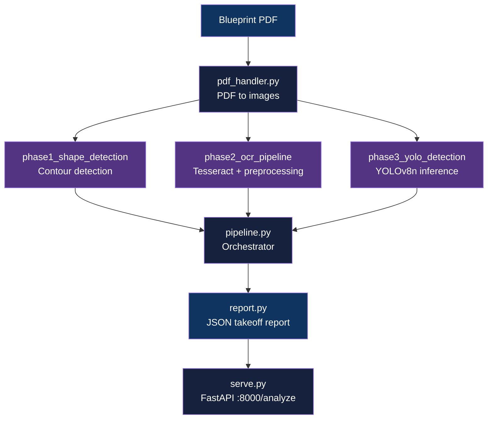
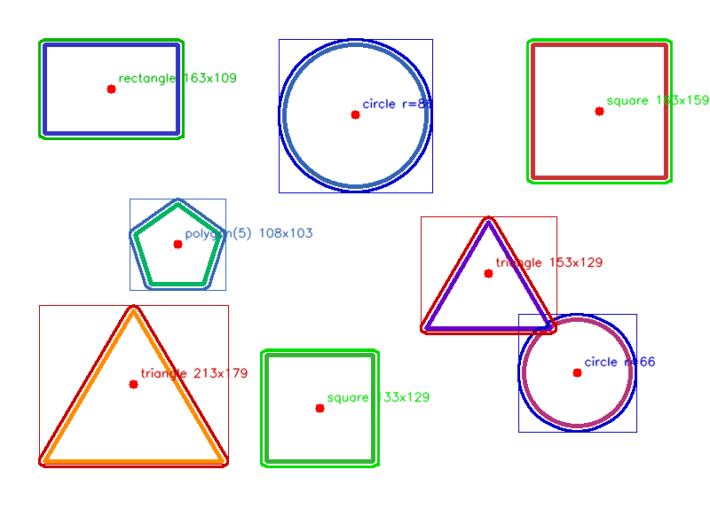
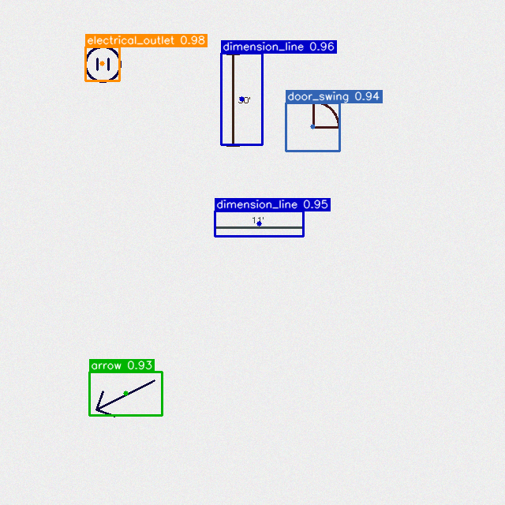

<div align="center">

# cv-pipeline

[](https://www.python.org/downloads/)
[](LICENSE)

**Progressive CV pipeline for construction blueprints: shape detection, OCR, YOLO symbols, multi-stage analyzer**

[Getting Started](#getting-started) | [Usage](#usage) | [Architecture](#architecture) | [API Reference](#api-reference)

</div>

---

## Table of Contents

- [The Problem](#the-problem)
- [Features](#features)
- [Tech Stack](#tech-stack)
- [Architecture](#architecture)
- [Demo](#demo)
- [Getting Started](#getting-started)
  - [Prerequisites](#prerequisites)
  - [Installation](#installation)
- [Usage](#usage)
- [How It Works](#how-it-works)
- [API Reference](#api-reference)
- [Methodology](#methodology)
- [Results](#results)
- [Data Engineering](#data-engineering)
- [Architectural Decisions](#architectural-decisions)
- [Project Structure](#project-structure)
- [Testing](#testing)
- [Deployment](#deployment)
- [Related Projects](#related-projects)
- [License](#license)
- [Author](#author)

## The Problem

### Manual blueprint takeoffs are slow and error-prone

Construction projects rely on blueprint takeoffs (extracting counts, dimensions, and symbol placements) to estimate cost and materials. Doing this manually from dense PDF drawings is time-consuming and inconsistent across engineers.

### The Solution

cv-pipeline automates takeoffs by composing three independent CV modules (contour-based shape detection, Tesseract OCR with preprocessing, and YOLOv8n symbol recognition) into a single orchestrated analyzer that processes multi-page PDFs and outputs structured JSON reports.

## Features

- **Shape Detection** - contour-based detection of rectangles, circles, triangles, and polygons using color segmentation and Canny edge fallback for monochrome images
- **OCR Pipeline** - text extraction with Tesseract including deskew, denoise, and threshold preprocessing, plus table detection via morphological line isolation
- **YOLO Symbol Detection** - YOLOv8n fine-tuned on 5 construction symbol classes (arrows, dimension lines, door swings, electrical outlets) with mAP@50 of 0.992
- **Blueprint Analyzer** - multi-stage orchestrator composing all three phases per PDF page with graceful per-phase failure handling
- **FastAPI Server** - upload a PDF blueprint via HTTP and receive a structured JSON takeoff report at `POST /analyze`

## Tech Stack

| Component | Technology |
|-----------|------------|
| Language | Python 3.12+ |
| Computer Vision | OpenCV, NumPy |
| OCR | Tesseract (pytesseract), pdf2image |
| Object Detection | YOLOv8n (ultralytics), PyTorch |
| Serving | FastAPI, Uvicorn |
| Report Generation | ReportLab |
| Testing | pytest |

## Architecture


```mermaid
graph TD
    PDF["Blueprint PDF"] --> CONVERT["pdf_handler.py<br/>PDF to images"]

    CONVERT --> S["phase1_shape_detection<br/>Contour detection"]
    CONVERT --> T["phase2_ocr_pipeline<br/>Tesseract + preprocessing"]
    CONVERT --> Y["phase3_yolo_detection<br/>YOLOv8n inference"]

    S --> MERGE["pipeline.py<br/>Orchestrator"]
    T --> MERGE
    Y --> MERGE

    MERGE --> REPORT["report.py<br/>JSON takeoff report"]
    REPORT --> API["serve.py<br/>FastAPI :8000/analyze"]

    style PDF fill:#0f3460,color:#fff
    style CONVERT fill:#16213e,color:#fff
    style S fill:#533483,color:#fff
    style T fill:#533483,color:#fff
    style Y fill:#533483,color:#fff
    style MERGE fill:#16213e,color:#fff
    style REPORT fill:#0f3460,color:#fff
    style API fill:#16213e,color:#fff
```

Each phase runs independently. If one stage fails (e.g., YOLO weights missing), the others still complete and their results are preserved in the report.

## Demo

Phase 1 output - annotated shape detections on a synthetic blueprint:



Phase 3 output - YOLOv8n construction symbol detections:



## Getting Started

### Prerequisites

- Python 3.12+
- Tesseract OCR: `sudo apt-get install tesseract-ocr`
- Poppler: `sudo apt-get install poppler-utils`

### Installation

1. Clone the repository:
   ```bash
   git clone https://github.com/adityonugrohoid/cv-pipeline.git
   cd cv-pipeline
   ```

2. Create and activate a virtual environment:
   ```bash
   python -m venv .venv
   source .venv/bin/activate
   ```

3. Install dependencies:
   ```bash
   pip install -r requirements.txt
   ```

## Usage

```bash
# Generate sample assets for all phases
python -m phase1_shape_detection.cli generate
python -m phase2_ocr_pipeline.cli generate
python -m phase3_yolo_detection.cli generate
python -m phase4_blueprint_analyzer.cli generate

# Train the YOLO model (~2 min on GPU, ~10 min on CPU)
python -m phase3_yolo_detection.cli train --data data/yolo_dataset/data.yaml --epochs 20

# Run the full pipeline on a blueprint PDF
python -m phase4_blueprint_analyzer.cli analyze \
  --input assets/sample_blueprint.pdf \
  --output outputs/report.json
```

Run individual phases directly:

```bash
# Shape detection
python -m phase1_shape_detection.cli detect \
  --input assets/sample_shapes.png \
  --output outputs/shapes.png \
  --json outputs/shapes.json

# OCR extraction
python -m phase2_ocr_pipeline.cli extract \
  --input assets/sample_text.png \
  --json outputs/text.json

# YOLO inference
python -m phase3_yolo_detection.cli detect \
  --input image.png \
  --output output.png \
  --weights models/best.pt
```

## How It Works

### 1. Shape detection (Phase 1)

Converts the input image to HSV and isolates color-segmented masks for each shape class. Contour extraction identifies candidate regions; each region is classified by vertex count (4 vertices = rectangle/square, 0 vertices with high circularity = circle) and bounding-box aspect ratio. Canny edge detection provides a fallback path for monochrome blueprint images where color segmentation yields no results.

### 2. OCR pipeline (Phase 2)

Applies a fixed preprocessing sequence: grayscale conversion, Gaussian denoise, Otsu threshold, and deskew via horizontal projection. Tesseract runs on the cleaned image with page-segmentation mode 6 (assume a uniform block of text). Text region grouping clusters nearby word bounding boxes into logical blocks; table detection uses morphological dilation to isolate horizontal and vertical line structures and then runs cell-level OCR on the resulting grid.

### 3. YOLO symbol detection (Phase 3)

A synthetic dataset generator creates labeled construction symbols (arrows, dimension lines, door swings, electrical outlets, plus a negative class) with randomized scale, rotation, and background clutter. YOLOv8n is fine-tuned for 20 epochs with the generated dataset. Inference uses the trained weights with non-maximum suppression at IoU threshold 0.45.

### 4. Blueprint analyzer orchestrator (Phase 4)

`pdf_handler.py` converts each PDF page to a PIL image at 150 DPI. The orchestrator runs Phases 1-3 through their respective layer wrappers (`shape_layer.py`, `text_layer.py`, `symbol_layer.py`) in sequence. Each layer returns a result dict or a typed failure object. `pipeline.py` merges all per-page results into a flat structure; `report.py` serializes the merged output to a JSON takeoff report.

## API Reference

Start the server:

```bash
python -m uvicorn phase4_blueprint_analyzer.serve:app --host 0.0.0.0 --port 8000
```

### Endpoints

| Method | Endpoint | Description |
|--------|----------|-------------|
| `GET` | `/health` | Health check |
| `POST` | `/analyze` | Upload PDF, receive JSON takeoff report |
| `GET` | `/docs` | Interactive Swagger UI |

### Example Request

```bash
curl -X POST http://localhost:8000/analyze \
  -F "file=@assets/sample_blueprint.pdf"
```

### Example Response

```json
{
  "pages": [
    {
      "page": 1,
      "shapes": { "rectangles": 12, "circles": 3 },
      "text_blocks": 8,
      "symbols": { "door_swing": 4, "electrical_outlet": 6 }
    }
  ]
}
```

## Methodology

### Problem framing

| Attribute | Value |
|-----------|-------|
| Problem Type | Multi-class object detection + OCR |
| Target | 5 construction symbol classes |
| Primary Metric | mAP@50 |
| Key Challenge | No real labeled blueprint dataset; required synthetic data generation |

### Training approach

| Parameter | Value |
|-----------|-------|
| Base model | YOLOv8n (ultralytics) |
| Dataset | Synthetic, generated by `phase3_yolo_detection/dataset.py` |
| Epochs | 20 |
| Validation | Hold-out split from synthetic generator |
| Baseline | mAP@50 = 0 (untrained YOLOv8n on construction symbols) |

## Results

### Key metrics

| Metric | Score |
|--------|-------|
| mAP@50 | 0.992 |
| Test suite | 66 passing tests across 4 phases |

See `docs/examples/phase3/metrics.json` for full per-class precision and recall.

## Data Engineering

| Attribute | Value |
|-----------|-------|
| Data source | Synthetic, generated programmatically |
| Symbol classes | 5 (arrow, dimension line, door swing, electrical outlet, negative) |
| Augmentations | Random scale, rotation, background clutter |
| Generator | `phase3_yolo_detection/dataset.py` |

The synthetic generator eliminates the need for a real annotated blueprint corpus and allows deterministic test fixture generation for the YOLO test suite.

## Architectural Decisions

### 1. Phase isolation with graceful failure

**Decision:** Each phase (shape, OCR, YOLO) runs as an independent module. `pipeline.py` catches per-phase exceptions and records a typed failure object rather than aborting the full pipeline.

**Reasoning:** YOLO weights are gitignored and must be trained locally. A first-run user who has not yet trained the model still gets shape and OCR results. This also makes each phase independently testable without requiring the full environment.

### 2. Synthetic dataset over real annotations

**Decision:** The YOLO training corpus is generated entirely by `dataset.py` rather than hand-annotated from real blueprints.

**Reasoning:** Real annotated blueprint datasets are proprietary or absent. Synthetic generation provides full label control, deterministic fixtures for CI, and unlimited data volume at zero annotation cost. The trade-off is reduced domain realism, which the 0.992 mAP@50 result shows is acceptable for this symbol set.

### 3. FastAPI over CLI-only delivery

**Decision:** Phase 4 ships both a CLI entry point and a FastAPI server (`serve.py`) that accepts multipart PDF uploads.

**Reasoning:** An HTTP interface makes the pipeline consumable by external tools (browser, Postman, downstream services) without requiring a Python environment on the client. The CLI stays as the primary developer interface; the server adds zero friction for integration.

## Project Structure

```
cv-pipeline/
├── phase1_shape_detection/       # Contour-based shape detection
│   ├── detector.py               #   Shape classification (vertex count + circularity)
│   ├── annotator.py              #   Draw detections on image
│   ├── export.py                 #   JSON export
│   ├── cli.py                    #   CLI entrypoint
│   └── tests/                    #   17 tests
│
├── phase2_ocr_pipeline/          # Tesseract OCR with preprocessing
│   ├── preprocess.py             #   Deskew, denoise, threshold
│   ├── ocr_engine.py             #   Tesseract wrapper
│   ├── text_regions.py           #   Group text blocks into regions
│   ├── table_detector.py         #   Grid detection + cell OCR
│   ├── cli.py                    #   CLI entrypoint
│   └── tests/                    #   18 tests
│
├── phase3_yolo_detection/        # YOLOv8n symbol detection
│   ├── dataset.py                #   Synthetic dataset generator
│   ├── train.py                  #   Fine-tune YOLOv8n
│   ├── evaluate.py               #   mAP, precision, recall
│   ├── detect.py                 #   Inference with NMS
│   ├── visualize.py              #   Draw detections
│   ├── cli.py                    #   CLI entrypoint
│   └── tests/                    #   13 tests
│
├── phase4_blueprint_analyzer/    # Multi-stage capstone pipeline
│   ├── pdf_handler.py            #   PDF to images (150 DPI)
│   ├── shape_layer.py            #   Phase 1 wrapper
│   ├── text_layer.py             #   Phase 2 wrapper
│   ├── symbol_layer.py           #   Phase 3 wrapper
│   ├── pipeline.py               #   Orchestrator with graceful failure
│   ├── report.py                 #   Structured JSON report
│   ├── serve.py                  #   FastAPI server
│   ├── cli.py                    #   CLI entrypoint
│   └── tests/                    #   18 tests
│
├── assets/                       # Sample images and PDFs for testing
├── docs/examples/                # Per-phase input/output examples
├── models/                       # Trained YOLO weights (gitignored)
├── outputs/                      # Generated reports (gitignored)
├── reference/                    # Original interview brief
├── Dockerfile
└── requirements.txt
```

## Testing

```bash
# Run all tests
pytest -v

# Run by phase
pytest phase1_shape_detection/tests/ -v
pytest phase2_ocr_pipeline/tests/ -v
pytest phase3_yolo_detection/tests/ -v
pytest phase4_blueprint_analyzer/tests/ -v
```

| Phase | Tests | Coverage |
|-------|-------|----------|
| 1 - Shape Detection | 17 | Detection accuracy, classification, JSON export |
| 2 - OCR Pipeline | 18 | Preprocessing, text extraction, accuracy on known text |
| 3 - YOLO Detection | 13 | Dataset generation, label format, inference, visualization |
| 4 - Blueprint Analyzer | 18 | Pipeline orchestration, report schema, graceful failure |
| **Total** | **66** | |

## Deployment

### Docker

```bash
docker build -t cv-pipeline .
docker run -p 8000:8000 cv-pipeline
```

The image installs Tesseract and Poppler at build time. Train YOLO weights before building, or mount a pre-trained `models/` directory:

```bash
docker run -p 8000:8000 -v $(pwd)/models:/app/models cv-pipeline
```

## Related Projects

| Project | Description |
|---------|-------------|
| [spatial-analysis](https://github.com/adityonugrohoid/spatial-analysis) | Automated spatial analysis pipeline for architectural floor plan PDFs: element extraction, wall annotation, room segmentation, and interactive web explorer |

## License

This project is licensed under the [MIT License](LICENSE).

## Author

**Adityo Nugroho** ([@adityonugrohoid](https://github.com/adityonugrohoid))
