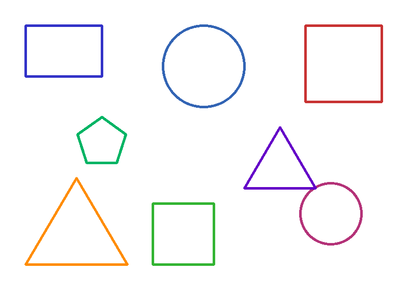
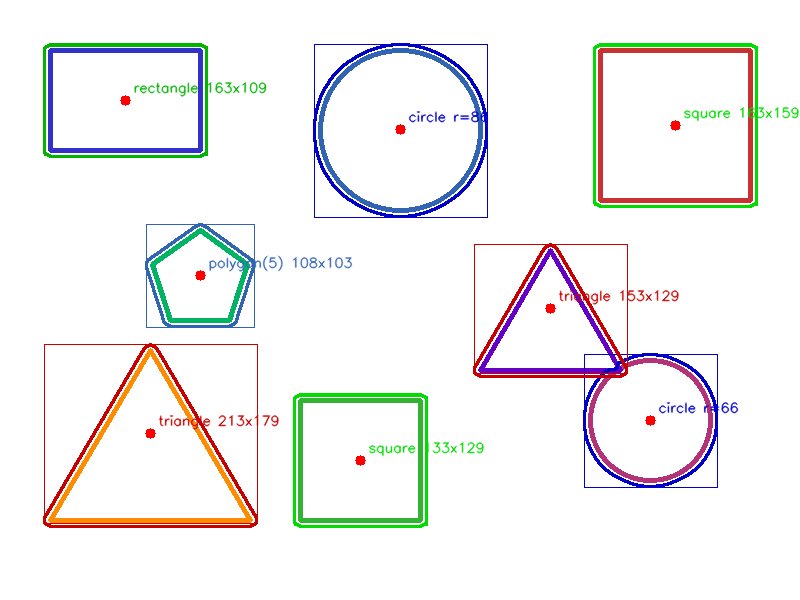

# Phase 1: Shape Detection — How It Works

## What Problem Does This Solve?

Imagine you have a photo of a technical drawing, and you need a computer to tell you "there are three rectangles, two circles, and a triangle in this image — and here is exactly where each one is and how big it is." That is what Phase 1 does. It takes an image, finds every geometric shape in it, and reports back what kind of shape each one is, where it sits, and how large it is. Think of it as giving a computer the ability to do what a child does when they point at shapes in a picture book and name them.

## Why the Sample Image Is Intentionally Easy

The test image (`assets/sample_shapes.png`) is a deliberate best-case scenario, not a realistic input. It has a perfectly white background, thick lines, no overlapping shapes, and every shape drawn in a different color. This is like learning to catch by having someone gently toss a ball straight at your hands — it removes every variable except the one you are testing.

The color separation trick is the biggest simplification. Because each shape has its own unique color, the detector can isolate shapes one at a time — like sorting M&Ms by color before counting them. In the real world, that shortcut rarely exists. A construction blueprint is typically all black ink on white paper. Overlapping shapes share edges. Scanner noise muddies the background. There is no color trick to lean on.

That is why the detector also includes a fallback path (Canny edge detection) for when everything is the same color. It is less reliable — overlapping edges can merge, noise can create false shapes — but it is the starting point for handling real-world inputs. The later phases (YOLO in Phase 3, the combined pipeline in Phase 4) exist precisely because classical techniques like this one hit a ceiling when images get messy.

So think of Phase 1 as the foundation: proof that the shape classification logic (corner counting, circularity) works correctly when given clean input. The harder problem of extracting shapes from noisy, monochrome, overlapping real-world documents is what the rest of the project builds toward.

## How It Works, Step by Step

The process goes like this:

1. **You give it a picture.** Any image file with shapes drawn on it — a PNG, a JPG, whatever.

2. **It figures out what colors are used.** The system scans the image and asks, "What colors are the drawn lines?" It ignores the white background and groups similar-looking colors together. This is like squinting at a drawing and noticing "there are red lines, blue lines, and green lines."

3. **It isolates one color at a time.** For each color it found, it creates a black-and-white version of the image where only that color's lines are visible. This is like using a color filter — if you put on "red glasses," you would only see the red shapes. This separation is important because when two shapes overlap, processing them by color keeps them from merging into one blob.

4. **It traces the outlines.** On each black-and-white version, it traces along the edges of every shape, like running your finger along the border of a cookie cutter. These traced outlines are called "contours."

5. **It simplifies and classifies.** Each traced outline might have hundreds of tiny points. The system smooths them down to just the key corners. Then it counts those corners: three corners means triangle, four corners means rectangle or square, five or more corners means polygon. For circles, it uses a roundness test — a perfect circle gets a score of 1.0, and anything above 0.7 with many smooth points counts as a circle.

6. **It packages the results.** Each detected shape gets a report card: what type it is, where its center point is, how wide and tall it is, and how much area it covers.

7. **It produces two outputs.** A marked-up copy of the original image (shapes highlighted with colored boxes and labels) and a structured data file listing every shape's details.

## What Each File Does

**detector.py** — The brain. This is where the actual shape-finding happens. It scans the image for colors, creates the black-and-white masks, traces outlines, and decides "this is a circle, that is a triangle." If the image has no distinct colors (like a pencil sketch on gray paper), it falls back to a different method that looks for sharp changes in brightness to find edges instead.

**annotator.py** — The highlighter. Once the detector has found all the shapes, the annotator draws on top of the original image to show you what was found. Each shape type gets its own color (green for rectangles, blue for circles, red for triangles, and so on). It draws a box around each shape, puts a red dot at the center, and writes a label like "circle r=86" or "rectangle 163x109."

**export.py** — The note-taker. This takes the list of detected shapes and writes it out as a structured data file (JSON). Instead of a picture, you get a precise, machine-readable list — useful when another program needs to use the results, or when you want to search or filter the shapes later.

**cli.py** — The front door. This is how you actually run the tool from a terminal. You type a command, point it at an image file, and tell it where to save the results. It ties the other three files together: it calls the detector, then the annotator, then the exporter. It also has a "generate" mode that creates a sample test image with known shapes so you can try it out without needing your own image.

## Example: Input and Output

### Input

The sample image (`assets/sample_shapes.png`) contains 8 shapes drawn in distinct colors on a white background: 2 rectangles, 2 circles, 2 triangles, 1 square, and 1 pentagon.



### Output — Annotated Image

The detector draws color-coded bounding boxes, red center dots, and dimension labels on each detected shape.



### Output — Structured JSON

Each shape gets a report card: type, location, dimensions, and shape-specific properties. The summary gives a quick count by type.

```json
{
  "shapes": [
    {
      "shape_type": "triangle",
      "center_x": 150, "center_y": 433,
      "width": 213, "height": 179,
      "confidence": 1.0, "vertices": 3, "area": 20841.0
    },
    {
      "shape_type": "circle",
      "center_x": 400, "center_y": 129,
      "width": 173, "height": 173,
      "confidence": 1.0, "radius": 86, "area": 23298.0, "circularity": 0.898
    },
    {
      "shape_type": "rectangle",
      "center_x": 125, "center_y": 100,
      "width": 163, "height": 109,
      "confidence": 1.0, "area": 18100.0, "aspect_ratio": 1.495
    }
  ],
  "summary": {
    "total": 8,
    "by_type": { "triangle": 2, "square": 2, "polygon": 1, "circle": 2, "rectangle": 1 }
  }
}
```

> Full output: [`docs/examples/phase1/output.json`](../docs/examples/phase1/output.json) (3 of 8 shapes shown above)

## Key Concepts Explained

**Contours** — Imagine laying a piece of string exactly along the edge of a shape in a picture. That string path is a contour. The computer traces these paths to find where shapes begin and end.

**Edge detection** — This is how the computer spots boundaries in an image. It looks for places where the image suddenly changes from light to dark (or one color to another) — those sudden changes are edges. It is like how you can see the outline of a mountain against the sky because the dark mountain meets the bright sky.

**Color segmentation** — This means splitting an image apart by color. If you had a bag of mixed M&Ms and sorted them into piles by color, that is color segmentation. The detector does this to separate overlapping shapes — a red rectangle crossing over a blue circle can be pulled apart because they are different colors.

**Contour approximation** — The raw traced outline of a shape might have thousands of tiny points. Contour approximation is like replacing a wobbly hand-drawn circle with a clean one — it simplifies the outline down to just the important corners. A triangle gets reduced to its three corner points, a rectangle to four, and so on.

**Circularity** — A measurement of how round something is. A perfect circle scores 1.0. A square scores about 0.78. A long thin rectangle scores much lower. The detector uses this to distinguish circles from polygons that happen to have many sides — a 20-sided polygon looks almost round, but a true circle will score higher.
