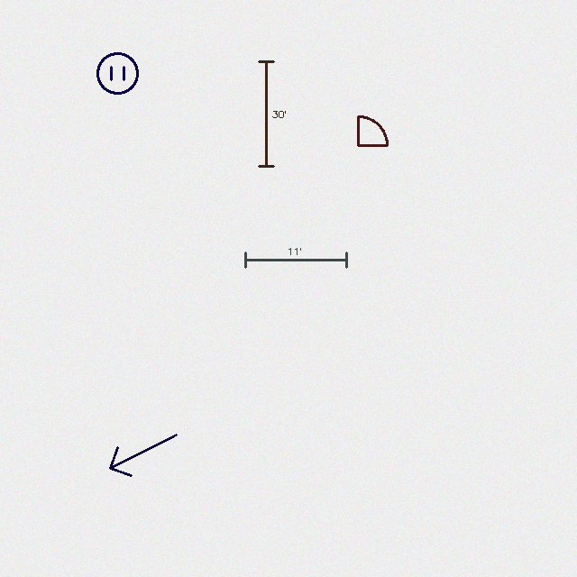
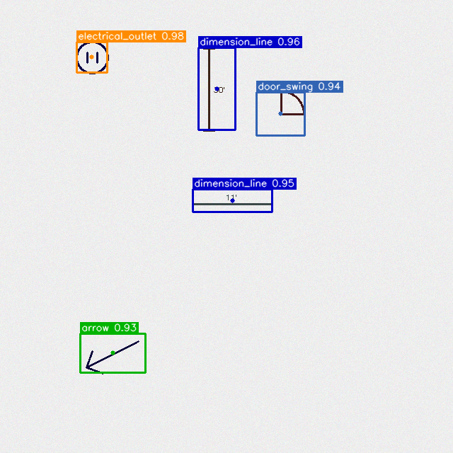

# Phase 3: YOLO Object Detection — How It Works

## What Problem Does This Solve?

Phase 1 can find basic geometric shapes and Phase 2 can read text, but neither can recognize specific symbols — an arrow pointing to an exit, a door swing arc, or an electrical outlet marking on a floor plan. These symbols are not just shapes; they carry meaning. Phase 3 teaches the computer to recognize these construction-specific symbols by training a neural network on examples, the same way you might teach a child to recognize letters by showing them flashcards over and over.

## Why We Made Our Own Training Data

Real construction blueprints with hand-labeled symbols would be ideal, but collecting and labeling hundreds of real examples is expensive and slow. Instead, Phase 3 generates its own training images programmatically — drawing arrows, dimension lines, circles with X marks, door swings, and electrical outlets on slightly noisy backgrounds. This is like a teacher making their own flashcards instead of buying them. The symbols are simple and synthetic, but they are enough for the model to learn the visual patterns. In a production system, you would replace or supplement this with real blueprint data.

## How It Works, Step by Step

1. **Generate training data.** The system creates 200 images, each containing 2-5 randomly placed construction symbols. For every image, it also writes a label file that says exactly where each symbol is and what type it is. These label files use a format called YOLO format — each line is a class number plus four numbers describing the symbol's position and size. The images are split 80/20 into training and validation sets.

2. **Train the model.** The system starts with YOLOv8n ("nano"), a small but capable object detection model that already knows how to find things in images — it was pre-trained on a large dataset of everyday objects (cars, people, dogs). We then fine-tune it on our construction symbols for 20 rounds (called epochs). This is like teaching someone who already knows how to draw to specialize in architectural symbols — they don't start from zero.

3. **Evaluate the results.** After training, the system tests the model on the validation images it has never seen during training. It measures how accurately the model finds symbols (precision — did it avoid false alarms?) and how completely (recall — did it miss any?). It also computes mAP (mean average precision), the standard scorecard for object detection.

4. **Run detection on new images.** You give the trained model any image, and it returns a list of found symbols — each with a class name (e.g., "door_swing"), a confidence score (how sure it is), and the exact bounding box on the image. Overlapping detections are cleaned up using a technique called NMS (non-maximum suppression), which keeps the best detection when two boxes overlap too much.

5. **Visualize the results.** The system draws the detections on the image with color-coded boxes and labels showing the class name and confidence score.

## What Each File Does

**dataset.py** — The flashcard maker. This creates the synthetic training dataset. It draws five types of construction symbols (arrows, dimension lines, circles with X, door swings, electrical outlets) on random near-white backgrounds, with slight noise to make the training more realistic. For each image, it writes a label file in YOLO format. It splits everything into training and validation folders and creates a `data.yaml` file that tells the training system where to find the data.

**train.py** — The teacher. This loads a pre-trained YOLOv8n model and fine-tunes it on the synthetic dataset. Think of it as taking a general-purpose visual recognition system and specializing it for construction symbols. Training runs for 20 epochs (complete passes through the data), and the best-performing version of the model is saved as a weights file.

**evaluate.py** — The examiner. After training, this runs the model on the validation images and generates a report card: overall mAP scores, and per-class precision and recall. It also generates a confusion matrix — a grid showing which classes the model confuses with each other (e.g., does it sometimes mistake an electrical outlet for a circle-X?).

**detect.py** — The detective. This takes a trained model and an image, runs the model, and returns what it found. Each detection comes back as a structured object with the class name, confidence score, bounding box, and center point. It applies NMS to remove duplicate detections of the same object.

**visualize.py** — The highlighter. Like Phase 1's annotator, this draws detections on the image. Each symbol class gets its own color — green for arrows, blue for dimension lines, red for circle-X marks, and so on. Each box has a label showing the class name and confidence score.

**cli.py** — The front door. A command-line interface that lets you run any step: generate a dataset, train the model, evaluate it, or detect symbols in an image.

## Example: Input and Output

### Input

A synthetic validation image containing randomly placed construction symbols (arrows, dimension lines, circles with X, door swings, electrical outlets) on a noisy near-white background.



### Output — Annotated Image

The trained model draws color-coded bounding boxes with class labels and confidence scores on each detected symbol.



### Output — Detection JSON

Each detection includes the class name, confidence score, bounding box `[x, y, w, h]`, and center point.

```json
[
  { "class": "electrical_outlet", "confidence": 0.98, "bbox": [108, 59, 43, 43], "center": [129, 80] },
  { "class": "dimension_line",    "confidence": 0.96, "bbox": [280, 67, 52, 116], "center": [306, 125] },
  { "class": "door_swing",        "confidence": 0.94, "bbox": [362, 130, 68, 61], "center": [396, 160] },
  { "class": "arrow",             "confidence": 0.93, "bbox": [113, 471, 92, 55], "center": [159, 498] }
]
```

> Full output: [`docs/examples/phase3/output.json`](../docs/examples/phase3/output.json)

### Evaluation Metrics

The model's report card after 20 epochs on the synthetic dataset:

```
mAP@50: 0.992    mAP@50-95: 0.898

arrow:              P=1.000  R=0.956  AP50=0.994
dimension_line:     P=1.000  R=1.000  AP50=0.995
circle_x:           P=1.000  R=1.000  AP50=0.995
door_swing:         P=0.989  R=0.968  AP50=0.982
electrical_outlet:  P=1.000  R=1.000  AP50=0.995
```

> Full metrics: [`docs/examples/phase3/metrics.json`](../docs/examples/phase3/metrics.json)

## Key Concepts Explained

**YOLO (You Only Look Once)** — A family of object detection models designed to be fast. Instead of scanning an image piece by piece, YOLO looks at the whole image in one pass and predicts all the objects at once. Think of it as glancing at a room and immediately knowing where the chairs, tables, and lamps are, rather than slowly scanning left to right.

**Fine-tuning** — Taking a model that already knows how to recognize general objects and retraining it slightly so it learns your specific objects too. It is like teaching a professional photographer to also identify plant species — they already understand composition, focus, and lighting, so they just need the new subject-matter knowledge.

**mAP (Mean Average Precision)** — The standard scorecard for detection models. mAP@50 asks "did the model find the object and get the location roughly right?" (allowing 50% overlap between predicted and actual box). mAP@50-95 is stricter, averaging across tighter overlap requirements. A score of 0.99 means near-perfect detection.

**NMS (Non-Maximum Suppression)** — A cleanup step. The model might produce several slightly overlapping boxes for the same object. NMS keeps only the most confident one and throws away the rest. It is like a group of people all pointing at the same thing — you only need one pointer.

**Confidence score** — The model's self-reported certainty for each detection, from 0 to 1. A score of 0.95 means the model is very sure; 0.3 means it is guessing. Setting a confidence threshold (like 0.25) filters out weak guesses.

**Synthetic data** — Training data that is generated by a computer rather than collected from the real world. It is faster and cheaper to produce, and useful for proving a concept, but models trained only on synthetic data may struggle with real-world messiness.
